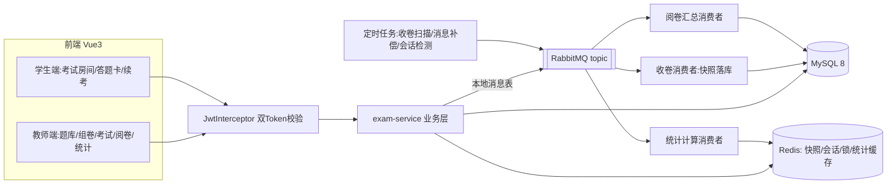

# Campus Exam Platform · 校内在线考试平台

[](.github/workflows/ci.yml)
[](LICENSE)
[](https://adoptium.net)
[](https://spring.io/projects/spring-boot)

面向校内教学场景的轻量级在线考试平台，覆盖 **教师备课 → 智能组卷 → 学生考试 → 自动收卷 → 异步阅卷 → 成绩统计** 全流程。
后端 Spring Boot 多模块单体，Redis 承载答题快照与会话，RabbitMQ 异步收卷解耦，前端 Vue3 最小演示端，支持 200 人同场并发作答。

## 功能矩阵

| 模块 | 能力 |
|---|---|
| 题库管理 | 单选/多选/判断/填空/简答 5 种题型、知识点标签、1~5 级难度、题目引用计数 |
| 智能组卷 | 题型数量 × 期望平均难度 × 知识点覆盖率多维约束，贪心 + 回溯求解，秒级出卷，可预览微调 |
| 考试防护 | JWT + 一次性考试 Token 双重校验、切屏检测上报、滑动会话过期、横向越权拦截 |
| 答题状态 | Redis Hash 答题快照、3 秒防抖自动保存、断线续考回填、Redisson 分布式锁防并发交卷 |
| 自动收卷 | 定时扫描到点考试 → MQ 异步收卷 → 快照落库，本地消息表保证最终一致、失败补偿与死信兜底 |
| 异步阅卷 | 客观题交卷即时出分；主观题逐题打分评语；异步汇总最终成绩单 |
| 成绩统计 | 平均/最高/及格率/分数段/逐题得分率，Cache-Aside 缓存，命中率 90%+ |
| 可观测 | Spring Boot Actuator 健康检查、AOP 接口耗时与异常日志、Knife4j 在线接口文档 |

## 技术栈

- **后端**：Java 17、Spring Boot 3.2.5、MyBatis-Plus 3.5.7、MySQL 8、Redis 7、Redisson 3.31、RabbitMQ 3.12、JJWT 0.12、Knife4j 4.5
- **前端**：Vue 3.5、Vite 5、Element Plus 2.8、Pinia、Vue Router 4、Axios
- **工程**：Maven 多模块、JUnit 5、GitHub Actions CI、Docker Compose、JMeter

## 系统架构



模块划分：

| 模块 | 职责 |
|---|---|
| `exam-common` | 统一结果体、枚举、Redis Key/MQ 常量、JWT 工具、用户上下文 |
| `exam-model` | 实体、DTO、VO、MQ 消息体 |
| `exam-mapper` | MyBatis-Plus Mapper 与自定义聚合 SQL |
| `exam-service` | 业务服务、组卷算法、判分器、可靠消息发送、单测 |
| `exam-admin` | 启动类、配置、拦截器、AOP、Controller、定时任务、MQ 消费者 |

## 快速开始

### 1. 启动中间件（任选其一）

```bash
docker compose up -d        # MySQL 3306 / Redis 6379 / RabbitMQ 5672,15672，自动初始化 sql/
```

连接信息（可用环境变量覆盖，见 `application-example.yml`）：MySQL `root/root123456`、RabbitMQ `exam/exam123456`（管理台 http://localhost:15672 ）。

### 2. 启动后端

```bash
mvn clean package -DskipTests
java -jar exam-admin/target/exam-server.jar
# 服务 http://localhost:8080 ，接口文档 http://localhost:8080/doc.html
```

首次启动自动执行 `sql/schema.sql`、`sql/data.sql`，并把演示账号密码加密入库。

### 3. 启动前端

```bash
cd frontend-mini
npm install
npm run dev                 # http://localhost:5173 ，已配置 /api 代理到 8080
```

### 演示账号（密码均为 123456）

| 角色 | 账号 |
|---|---|
| 管理员 | admin |
| 教师 | teacher1 |
| 学生 | s1 ~ s6（s1~s4 在计算机2301班，预置考试 1） |

## 核心设计

- **双 Token 鉴权**：登录 JWT 做身份鉴权；每次进入考试房间签发绑定「考生 × 考试 × 时间窗」的一次性 `Exam-Token`，考试类接口双重校验，杜绝横向越权与重放。
- **答题快照与续考**：`exam:{examId}:user:{userId}` Hash 按题存答案，3 秒防抖自动保存；会话 Key 滑动 TTL，断线重进直接回填；交卷走 Redisson 锁防并发。
- **可靠收卷（最终一致）**：业务与本地消息表同事务写入，扫描投递 MQ；消费者幂等消费（`mq:idem:{msgKey}`），失败重试 3 次进死信，补偿任务每 30 秒重发未确认消息。
- **贪心 + 回溯组卷**：先按知识点硬约束保证覆盖率，再在题型组内贪心抽题，最后用交换逼近目标平均难度，约束无法满足时显式返回未满足项，不静默降级。
- **统计 Cache-Aside**：成绩发布触发异步计算并回写 `stat:class:{classId}:exam:{examId}`（30 分钟 TTL），看板优先命中缓存，响应中回带 `fromCache` 标识可观测。

更多细节见 [`docs/`](docs)：架构设计、组卷算法、状态机与一致性、压测报告。

## 压测

JMeter 脚本与 200 并发造数见 [`jmeter/`](jmeter)，链路为 登录 → 进入考试 → 5 次自动保存 → 交卷。

## 目录

```
.
├── exam-common / exam-model / exam-mapper / exam-service / exam-admin
├── frontend-mini          # Vue3 演示端
├── sql                    # 建表与演示数据
├── jmeter                 # 200 并发压测脚本与造数
├── docs                   # 设计文档
├── docker-compose.yml
└── Dockerfile             # 后端多阶段镜像构建
```

## License

[Apache License 2.0](LICENSE)，本项目为教学演示项目，题目与数据均为虚构。
