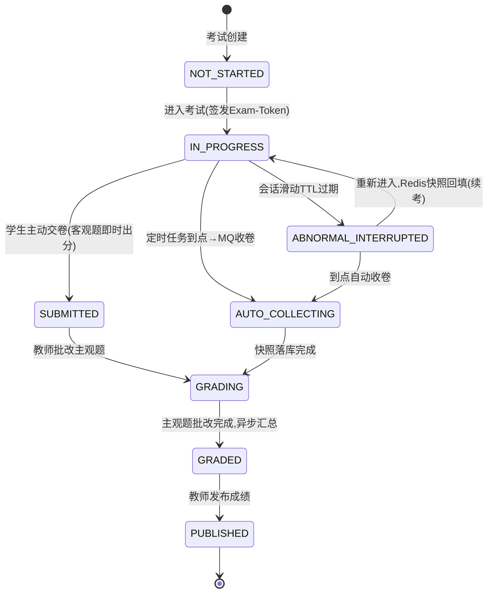

# 03 · 考试状态机与数据一致性

## 1. 考试记录状态机



- 终态判定 `isFinal()`：GRADED / PUBLISHED，终态后拒绝重复进入与重复交卷。
- 唯一键 `uk_exam_user(exam_id,user_id)` 从数据库层兜底「一人一记录」。

## 2. 双 Token 与防作弊

1. 登录颁发 JWT（无状态身份）。
2. 进入考试房间时颁发一次性 `Exam-Token`（UUID），Redis 记录其绑定的考生与考试；
   后续 autosave/heartbeat/violation/submit 必须同时携带 JWT 与 Exam-Token。
3. 校验内容：Token 存在、Token 绑定的 userId 与 JWT 用户一致、examId 一致、考试在时间窗口内；
   一次性意味着横向拿别人的 Token 无法通过「绑定关系」校验，天然防越权。
4. 前端监听 `visibilitychange`，离开页面上报违规；切屏次数超过监考策略上限时，后端在下次写操作时强制收卷。

## 3. 答题快照、续考与自动收卷时序

```mermaid
sequenceDiagram
    participant Stu as 学生端
    participant API as 后端
    participant RD as Redis
    participant DB as MySQL
    participant MQ as RabbitMQ
    Stu->>API: 进入考试(双Token校验)
    API->>RD: 读答题快照
    RD-->>Stu: 历史答案回填(续考)
    loop 每3秒防抖
        Stu->>API: autosave(单题)
        API->>RD: HSET 快照 + 滑动会话TTL
    end
    Note over Stu,RD: 网络断开→会话TTL过期标记异常;重进即续考
    participant Job as 定时任务(每分钟)
    Job->>DB: 扫描到点未终态考试
    Job->>MQ: 发送收卷指令(本地消息表同事务)
    MQ->>API: 收卷消费者(幂等)
    API->>RD: 读最终快照
    API->>DB: 批量落库 exam_answer/exam_record
    API->>RD: 清理会话与快照
```

## 4. 交卷路径与并发防护

- 学生主动交卷：Redisson 锁 `lock:submit:{examId}:{userId}`（看门狗续期），锁内做终态二次检查（double-check），
  客观题同步判分并立即返回客观分预览，主观题等待教师批改。
- 自动收卷与主动交卷可能竞争：两者都抢同一把 Redisson 锁，先到者把记录推进到后续状态，后到者读终态直接返回，保证只收一次。

## 5. 本地消息表 + MQ 的最终一致

关键业务（自动收卷、成绩汇总、统计计算）不直接「先写库再发 MQ」（两步非原子，会丢消息），而是：

1. 业务数据与 `local_message`（状态 PENDING、payload、msgKey）在**同一本地事务**写入；
2. 事务提交后由 `ReliableMessageSender` 发送 MQ，发送成功把消息标记 SENT；
3. 消费端按 `mq:idem:{msgKey}` 幂等，处理成功手动 ack；失败重试，3 次进死信队列；
4. 补偿任务每 30 秒扫描 PENDING/超时未确认消息重发，发送本身幂等（相同 msgKey + 消费端去重）。

这样保证「只要业务库写成功，消息最终一定被处理」，且重复投递不会产生重复业务结果。

## 6. 阅卷与统计一致性

- 客观题交卷即判（单选全等、多选全对才得分、判断全等、填空归一化精确匹配，`##` 分多空、`||` 分可接受答案，按空比例给分）。
- 主观题逐题打分写入 Redis 临时成绩；教师完成批改触发异步汇总：客观 + 主观合成总分落库，状态 GRADED。
- 发布成绩 PUBLISHED 后投递统计消息，计算班级指标并 Cache-Aside 回写；成绩变更使缓存失效后重算，看板响应带 `fromCache` 可验证命中率。
